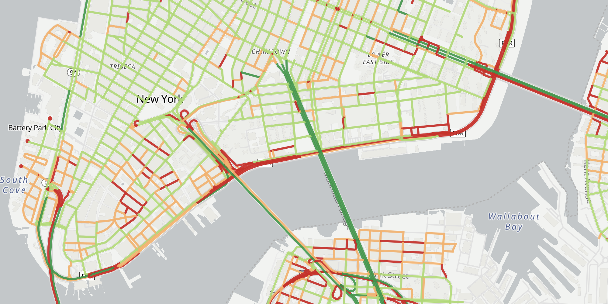

# CAV Road Profiles Map: A Global Typology of Urban Road Infrastructure for Automated Mobility

An interactive map visualizing a data-driven typology of road infrastructure across 100 global cities, developed to support evidence-based policy for automated mobility.

## About The Project

This project provides an interactive, web-based visualization of the global urban road infrastructure typology developed in our research paper, "Characterizing the Urban Road Network for Automated Mobility: A Scalable Typology for Evidence-Based Policy".

Using unsupervised machine learning on data from OpenStreetMap and Mapillary, we analyzed over 7 million road segments across 100 diverse cities. This process identified four distinct infrastructure profiles, ranging from 'Complex Urban Intersections' to 'Minimal Infrastructure, Sensor-Reliant Roads'. This map allows for a visual exploration of these findings, revealing the unique "infrastructure signature" of each city.

This tool is designed for urban planners, policymakers, researchers, and the public to:
*   Explore and compare the infrastructure patterns and signatures of different cities at a global scale.
*   Characterize the heterogeneity of road environments and understand the varying operational conditions for automated systems.
*   Provide an evidence base for strategic investment, policy development, and academic research in the field of automated mobility.

## Key Features

*   **Interactive World Map:** Explore 100 cities with color-coded markers indicating their dominant infrastructure type.
*   **Detailed City View:** Select a city to view its entire road network, with each segment colored by its infrastructure cluster.
*   **Dynamic Filtering:** Toggle cluster visibility on the legend to isolate and analyze specific road types.
*   **Segment-Level Data:** Hover over any road segment to see its specific attributes in a popup.
*   **City-Wide Metrics:** View a summary of each city's cluster distribution and income level in a dedicated panel.

## Data and Methodology

The underlying road network data was sourced from **OpenStreetMap** and retrieved between **March and April 2025**. The cluster analysis and feature extraction were performed as part of the research detailed in the paper below.

### Associated Research Paper

This visualization is a companion to our academic research. For a detailed explanation of the methodology, cluster definitions, and findings, please refer to our paper:

**Link in the future**

### How to Cite

If you use this project, its data, or its findings in your research, please cite our work as follows:

`Citation in the future`

## License

This project uses a dual-license model:

*   The **source code** for this web application is licensed under the **[MIT License](LICENSE_CODE)**.
*   The **data** (`.pmtiles`, and `.json` files) is licensed under the **[Open Data Commons Open Database License (ODbL)](LICENSE_DATA)**.

## Contact

[Matheus Gomes Correia] – [https://www.linkedin.com/in/matheuscorreia/]